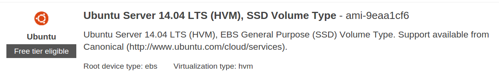

# Ubuntu LTS is FISMA Ready

This project creates hardened, FISMA Ready Ubuntu LTS Amazon Machine Instances (AMIs) that are suitable for use in Amazon Web Services (AWS). To be FISMA Ready, the AMI must be instantitated in either the US-East or US-West regions of AWS, or the AWS GovCloud, in order to properly inherit the AWS controls assessed by the [FedRAMP program](http://www.fedramp.gov/). We recommend additional customer level controls on top of the FedRAMP authorization for the AWS Console, and will be releasing those soon.

We are also working to expand support for other deployment environments and image types.

Prepared and maintained by **[18F](https://18f.gsa.gov)**, a Federal digital services team.

## What this does

* Takes a **fresh Ubuntu 14.04 LTS AMI** (`ami-9eaa1cf6`), as published by Canonical:



* Launches an `m3.medium` instance from this AMI in your AWS account's Classic region (not a VPC).

* Uses the included Chef cookbooks and templates to connect to the instance and configures to controls recommended by the [Center for Internet Security](http://www.cisecurity.org/).

* Creates a new AMI from the configured instance, and prints out the AMI ID.

## Setup

* Install the [Chef Development Kit for your OS](http://downloads.getchef.com/chef-dk/mac/#/). This includes both Knife and [Berkshelf](http://berkshelf.com/), which are critical dependencies.

* Install [Packer for your OS](http://www.packer.io/intro/getting-started/setup.html). For Mac OSX users, we highly recommend using a package manager like [Homebrew](http://brew.sh/) and then running:

```bash
$ brew doctor
$ brew tap homebrew/binary
$ brew install packer
```
At press time, we used Packer 0.7.5

```bash
$ packer version
Packer v0.7.5
```

* Set two environmental variables.

```bash
export AWS_ACCESS_KEY_ID=[your AWS access key]
export AWS_SECRET_ACCESS_KEY=[your AWS secret key]
```

## Building the AMI

1. Run `ami.sh`.

That's it! Take note of the AMI ID this spits out to your console after it's done.

### Involvement of 18F

The team at [18F](https://18f.gsa.gov) decided to start work where FedRAMP stops for open source components in a true infrastructure as a service environment - at the operating system layer. Secure baselines were available for Windows, Solaris, and Red Hat Enterprise Linux. But, there were no generally available &mdash; and certainly not public &mdash; baselines, for Ubuntu or the Debian version of Linux generally.

18F is committed to [free and open source software](https://github.com/18F/open-source-policy/blob/master/policy.md) - our intention is that the software we write can be run _anywhere_, without the need to pay for licensing fees.

### Caveat emptor

Our hardened version of Ubuntu is still in *_active development_*. It is subject to change rapidly. Our intention is that no changes will be system breaking, and testing both in local virtual machines and the AWS is ongoing. We have also started to put common web workloads on servers running the hardened OS and no issues have yet arisen. Always use a testing environment before deploying a new OS configuration into production, and please report back with any [Issues](https://github.com/fisma-ready/ubuntu-lts/issues) or [Pull Requests](https://github.com/fisma-ready/ubuntu-lts/pulls).
